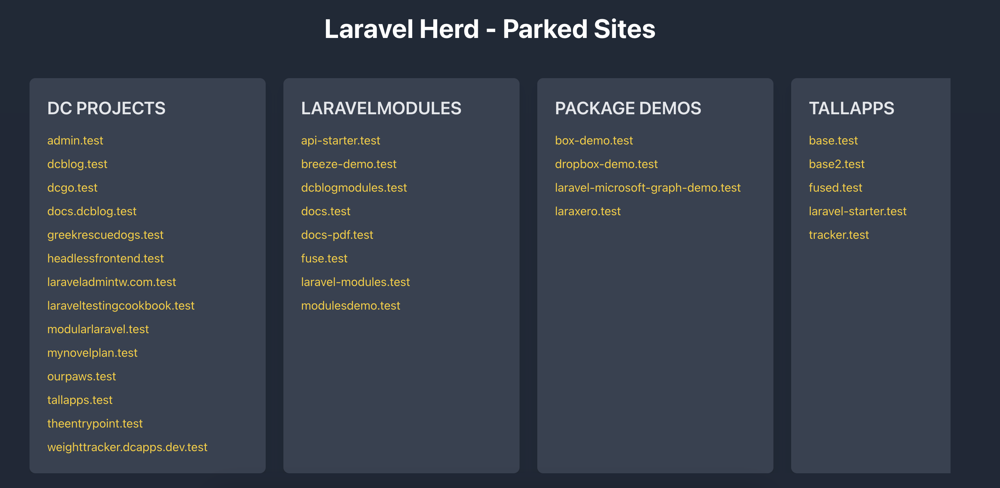

# Herd Localhost

This project provides a simple way to list and display Laravel projects parked by Laravel Herd. The application scans directories and organizes them into a scrollable grid using PHP and Tailwind CSS.

Features:
- 📂 List all parked Laravel projects in the Herd directory.
- 🛑 Exclude specific folders (localhost, backup, etc.) from the list.
- 🌐 Sub-projects are listed under each main project folder.
- 🎨 Clean and responsive design using Tailwind CSS.

Example:



## Setup and Installation:

### Requirements:
- PHP 8+
- Laravel Herd

### Install

Clone or Download the Project into the root of the Herd folder:

```bash
git clone https://github.com/dcblogdev/herd-localhost.git localhost
```

Then access http://localhost will show all projects found in the herd folder.

Exclude any folders from being scanned, open `index.php` and add folder to the `$excludes = []` array.
